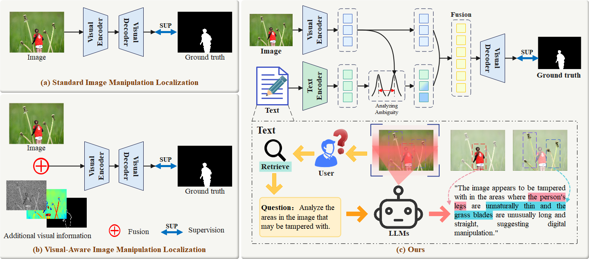

# <center> Bridging Semantic Logic Gaps: A Cognition Inspired Multimodal Boundary Preserving Network for Image Manipulation Localization

## 🚀 Motivation



Comparison with mainstream IML methods. We use LLMs to analyze potential tampered regions in images and generate prompt-based textual information to enhance visual features. In addition, the text features are weighted by quantifying the ambiguity of images and texts, which solves the inaccurate localization caused by the hallucination problem of LLMs.


## 📆 TODO
Our complete codebase will be released upon paper acceptance.

Welcome to watch 👀 this repository for the latest updates.

- [x] [2025.9.27]: The loss function code has been released.
- [x] [2025.9.28]: The predicted mask has been released.
- [x] [2025.9.28]: The evaluation code has been released.
- [ ] The textual data generated by LLMs.
- [ ] The complete model code.
- [ ] Training and inference code released.

## 🎮 Getting Started

### 1. Install Environment

```bash
conda env create -f CMB-Net.yaml
```


### 2. Prepare Datasets
| Dataset     | Nums        |  #CM          | #SP          | #IP          |  #Train          |  #Test          | 
| :----:      |    :----:   |         :----:|:----:        |    :----:    |         :----:   |         :----:  |
| CASIAv2.0   | 5123        | 3295          |1828          |    0         |        5123      |        0        |
| CASIAv1.0   | 920         | 459           |461           |    0         |        0         |        920      |
| Coverage    | 100         | 100           |0             |    0         |        70        |        30       |
| Columbia    | 180         | 0             |180           |    0         |         130      |        50       |
| NIST16      | 564         | 68            |288           |    208       |        414       |        150      |


- CASIAv2.0 [Download](https://github.com/SunnyHaze/IML-Dataset-Corrections)
- CASIAv1.0 [Download](https://github.com/SunnyHaze/IML-Dataset-Corrections)
- Columbia  [Download](https://www.ee.columbia.edu/ln/dvmm/downloads/authsplcuncmp/)
- Coverage  [Download](https://github.com/wenbihan/coverage?tab=readme-ov-file)
- NIST16    [Download](https://mfc.nist.gov/users/sign_in)

### 3. Train the Net

Upon Acceptance -> Codebase Liberation Activated 🔓

### 4. Test the Net

Upon Acceptance -> Codebase Liberation Activated 🔓

